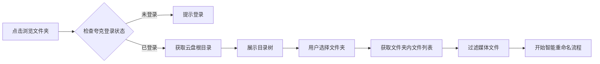

# 智能重命名功能完善开发文档

## 📋 文档信息
- **创建时间**: 2026-02-04
- **版本**: v1.0
- **目标**: 完善智能重命名功能，集成夸克云盘文件浏览器

---

## 🎯 功能概述

### 当前状态
智能重命名功能已实现基础框架，包括：
- ✅ 多算法支持（标准/AI增强/纯AI）
- ✅ Emby/Plex/Kodi 命名标准
- ✅ 本地文件扫描和重命名
- ✅ TMDB 元数据匹配
- ✅ 预览和批量执行
- ✅ 回滚机制

### 缺失功能
- ❌ **夸克云盘文件浏览器**（点击"浏览文件夹"显示"功能开发中"）
- ❌ 夸克云盘文件列表获取
- ❌ 云盘文件直接重命名
- ❌ 云盘目录树展示

---

## 🔍 功能需求分析

### 1. 夸克云盘文件浏览器

#### 1.1 用户故事
```
作为用户，我希望：
- 点击"浏览文件夹"按钮时，能看到夸克云盘的目录结构
- 可以浏览云盘中的文件夹
- 可以选择云盘中的某个文件夹作为重命名目标
- 可以直接对云盘文件进行智能重命名
```

#### 1.2 功能流程


### 2. 夸克 API 集成需求

#### 2.1 必需的 API 接口

##### 2.1.1 获取文件列表
```python
# API: 获取指定目录下的文件和文件夹
GET /quark/list
参数:
  - pdir_fid: 父目录ID（根目录为"0"）
  - page: 页码
  - size: 每页数量
  - _fetch_total: 是否获取总数
  - _fetch_sub_dirs: 是否获取子目录
  
响应:
{
  "data": {
    "list": [
      {
        "fid": "文件ID",
        "file_name": "文件名",
        "pdir_fid": "父目录ID",
        "category": "文件类型",
        "file_type": 文件类型编号,
        "size": 文件大小,
        "format_type": "格式类型",
        "status": 状态,
        "created_at": 创建时间,
        "updated_at": 更新时间
      }
    ],
    "metadata": {
      "_total": 总数
    }
  }
}
```

##### 2.1.2 重命名文件
```python
# API: 重命名云盘文件
POST /quark/rename
参数:
  - fid: 文件ID
  - file_name: 新文件名
  
响应:
{
  "status": 200,
  "message": "success",
  "data": {
    "fid": "文件ID",
    "file_name": "新文件名"
  }
}
```

##### 2.1.3 批量重命名
```python
# API: 批量重命名云盘文件
POST /quark/batch_rename
参数:
  - operations: [
      {
        "fid": "文件ID",
        "new_name": "新文件名"
      }
    ]
  
响应:
{
  "status": 200,
  "data": {
    "success": 成功数量,
    "failed": 失败数量,
    "results": [
      {
        "fid": "文件ID",
        "status": "success/failed",
        "message": "错误信息（如果失败）"
      }
    ]
  }
}
```

##### 2.1.4 移动文件
```python
# API: 移动文件到指定目录
POST /quark/move
参数:
  - fid: 文件ID
  - to_pdir_fid: 目标目录ID
  - new_name: 新文件名（可选）
  
响应:
{
  "status": 200,
  "data": {
    "fid": "文件ID",
    "pdir_fid": "新父目录ID"
  }
}
```

---

## 🏗️ 技术方案

### 方案 1: 后端 API 开发

#### 1.1 新增 API 端点

##### 文件: `app/api/quark.py`（已存在，需扩展）

```python
@router.get("/browse")
async def browse_quark_directory(
    pdir_fid: str = Query("0", description="父目录ID，0表示根目录"),
    page: int = Query(1, ge=1),
    size: int = Query(100, ge=1, le=500),
    file_type: Optional[str] = Query(None, description="文件类型过滤：video/folder/all"),
    service: QuarkService = Depends(get_quark_service)
):
    """
    浏览夸克云盘目录
    
    用途: 获取指定目录下的文件和文件夹列表
    输入:
        - pdir_fid: 父目录ID
        - page: 页码
        - size: 每页数量
        - file_type: 文件类型过滤
    输出:
        - 文件和文件夹列表
    副作用: 调用夸克 API
    """
    try:
        result = await service.list_files(
            pdir_fid=pdir_fid,
            page=page,
            size=size
        )
        
        # 过滤文件类型
        items = result.get("list", [])
        if file_type == "video":
            # 只返回视频文件
            video_extensions = {'.mp4', '.mkv', '.avi', '.mov', '.wmv', '.flv'}
            items = [
                item for item in items
                if item.get("file_type") == 1  # 文件
                and any(item.get("file_name", "").lower().endswith(ext) for ext in video_extensions)
            ]
        elif file_type == "folder":
            # 只返回文件夹
            items = [item for item in items if item.get("file_type") == 0]
        
        return {
            "status": 200,
            "data": {
                "items": items,
                "total": result.get("metadata", {}).get("_total", len(items)),
                "page": page,
                "size": size
            }
        }
    except Exception as e:
        logger.error(f"Browse quark directory failed: {e}")
        raise HTTPException(status_code=500, detail=str(e))


@router.post("/smart-rename-cloud")
async def smart_rename_cloud_files(
    request: QuarkSmartRenameRequest,
    quark_service: QuarkService = Depends(get_quark_service),
    rename_service: SmartRenameService = Depends(get_smart_rename_service)
):
    """
    智能重命名夸克云盘文件
    
    用途: 对夸克云盘中的文件进行智能重命名
    输入:
        - pdir_fid: 目标目录ID
        - algorithm: 重命名算法
        - naming_standard: 命名标准
    输出:
        - 重命名预览结果
    副作用: 无（仅预览）
    """
    try:
        # 1. 获取云盘文件列表
        files = await quark_service.list_files(
            pdir_fid=request.pdir_fid,
            page=1,
            size=1000
        )
        
        # 2. 过滤视频文件
        video_files = [
            f for f in files.get("list", [])
            if f.get("file_type") == 1 and is_video_file(f.get("file_name", ""))
        ]
        
        # 3. 对每个文件进行智能解析
        items = []
        for file in video_files:
            filename = file.get("file_name", "")
            
            # 使用智能重命名服务解析
            parsed_info, algorithm, confidence = await rename_service._parse_with_algorithm(
                filename,
                request.algorithm,
                force_ai=request.force_ai_parse
            )
            
            # TMDB 匹配
            tmdb_match, match_confidence = await rename_service._match_tmdb(
                parsed_info
            )
            
            # 生成新文件名
            item = SmartRenameItem(
                original_path=file.get("fid"),  # 使用 fid 作为标识
                original_name=filename,
                parsed_info=parsed_info,
                tmdb_id=tmdb_match.get("id") if tmdb_match else None,
                tmdb_title=tmdb_match.get("title") if tmdb_match else None,
                tmdb_year=tmdb_match.get("year") if tmdb_match else None,
                overall_confidence=(confidence + match_confidence) / 2,
                used_algorithm=algorithm
            )
            
            # 生成新名称
            new_path, new_name = rename_service._generate_new_name(item, request.options)
            item.new_name = new_name
            
            items.append(item)
        
        # 4. 返回预览结果
        return {
            "status": 200,
            "data": {
                "batch_id": str(uuid.uuid4()),
                "pdir_fid": request.pdir_fid,
                "total_items": len(items),
                "items": [
                    {
                        "fid": item.original_path,
                        "original_name": item.original_name,
                        "new_name": item.new_name,
                        "tmdb_title": item.tmdb_title,
                        "tmdb_year": item.tmdb_year,
                        "confidence": item.overall_confidence,
                        "needs_confirmation": item.overall_confidence < 0.7
                    }
                    for item in items
                ]
            }
        }
    except Exception as e:
        logger.error(f"Smart rename cloud files failed: {e}")
        raise HTTPException(status_code=500, detail=str(e))


@router.post("/execute-cloud-rename")
async def execute_cloud_rename(
    request: QuarkRenameExecuteRequest,
    quark_service: QuarkService = Depends(get_quark_service)
):
    """
    执行云盘文件重命名
    
    用途: 批量执行夸克云盘文件重命名
    输入:
        - operations: 重命名操作列表
    输出:
        - 执行结果统计
    副作用: 修改云盘文件名
    """
    try:
        results = []
        success_count = 0
        failed_count = 0
        
        for op in request.operations:
            try:
                # 调用夸克 API 重命名
                await quark_service.rename_file(
                    fid=op.fid,
                    new_name=op.new_name
                )
                results.append({
                    "fid": op.fid,
                    "status": "success"
                })
                success_count += 1
            except Exception as e:
                logger.error(f"Rename file {op.fid} failed: {e}")
                results.append({
                    "fid": op.fid,
                    "status": "failed",
                    "error": str(e)
                })
                failed_count += 1
        
        return {
            "status": 200,
            "data": {
                "total": len(request.operations),
                "success": success_count,
                "failed": failed_count,
                "results": results
            }
        }
    except Exception as e:
        logger.error(f"Execute cloud rename failed: {e}")
        raise HTTPException(status_code=500, detail=str(e))
```

#### 1.2 扩展 QuarkService

##### 文件: `app/services/quark_service.py`（需扩展）

```python
async def list_files(
    self,
    pdir_fid: str = "0",
    page: int = 1,
    size: int = 100
) -> Dict[str, Any]:
    """
    获取文件列表
    
    用途: 获取指定目录下的文件和文件夹列表
    输入:
        - pdir_fid: 父目录ID
        - page: 页码
        - size: 每页数量
    输出:
        - 文件列表数据
    副作用: 调用夸克 API
    """
    try:
        response = await self.api_client.list(
            pdir_fid=pdir_fid,
            page=page,
            size=size,
            _fetch_total=1,
            _fetch_sub_dirs=0
        )
        return response
    except Exception as e:
        logger.error(f"List files failed: {e}")
        raise


async def rename_file(
    self,
    fid: str,
    new_name: str
) -> Dict[str, Any]:
    """
    重命名文件
    
    用途: 重命名云盘中的文件
    输入:
        - fid: 文件ID
        - new_name: 新文件名
    输出:
        - 重命名结果
    副作用: 修改云盘文件名
    """
    try:
        response = await self.api_client.rename(
            fid=fid,
            file_name=new_name
        )
        return response
    except Exception as e:
        logger.error(f"Rename file failed: {e}")
        raise


async def move_file(
    self,
    fid: str,
    to_pdir_fid: str,
    new_name: Optional[str] = None
) -> Dict[str, Any]:
    """
    移动文件
    
    用途: 移动文件到指定目录
    输入:
        - fid: 文件ID
        - to_pdir_fid: 目标目录ID
        - new_name: 新文件名（可选）
    输出:
        - 移动结果
    副作用: 修改云盘文件位置
    """
    try:
        response = await self.api_client.move(
            fid=fid,
            to_pdir_fid=to_pdir_fid,
            new_name=new_name
        )
        return response
    except Exception as e:
        logger.error(f"Move file failed: {e}")
        raise
```

### 方案 2: 前端开发

#### 2.1 夸克文件浏览器组件

##### 文件: `web/src/components/QuarkFileBrowser.vue`（新建）

```vue
<template>
  <el-dialog
    v-model="visible"
    title="选择夸克云盘文件夹"
    width="800px"
    :close-on-click-modal="false"
  >
    <!-- 面包屑导航 -->
    <div class="breadcrumb-nav">
      <el-breadcrumb separator="/">
        <el-breadcrumb-item 
          v-for="(item, index) in breadcrumbs" 
          :key="item.fid"
          @click="navigateTo(item.fid)"
          class="breadcrumb-item"
        >
          {{ item.name }}
        </el-breadcrumb-item>
      </el-breadcrumb>
    </div>

    <!-- 文件列表 -->
    <div class="file-list" v-loading="loading">
      <div class="list-header">
        <div class="header-col name">名称</div>
        <div class="header-col type">类型</div>
        <div class="header-col size">大小</div>
        <div class="header-col time">修改时间</div>
      </div>

      <div class="list-body">
        <div
          v-for="item in fileList"
          :key="item.fid"
          class="file-item"
          :class="{ 
            'selected': selectedFid === item.fid,
            'folder': item.file_type === 0
          }"
          @click="handleItemClick(item)"
          @dblclick="handleItemDoubleClick(item)"
        >
          <div class="item-col name">
            <el-icon v-if="item.file_type === 0">
              <Folder />
            </el-icon>
            <el-icon v-else>
              <Document />
            </el-icon>
            <span>{{ item.file_name }}</span>
          </div>
          <div class="item-col type">
            {{ getFileType(item) }}
          </div>
          <div class="item-col size">
            {{ formatFileSize(item.size) }}
          </div>
          <div class="item-col time">
            {{ formatTime(item.updated_at) }}
          </div>
        </div>
      </div>

      <!-- 分页 -->
      <el-pagination
        v-if="total > pageSize"
        v-model:current-page="currentPage"
        v-model:page-size="pageSize"
        :total="total"
        layout="total, prev, pager, next"
        @current-change="loadFiles"
      />
    </div>

    <template #footer>
      <div class="dialog-footer">
        <div class="selected-info">
          <span v-if="selectedItem">
            已选择: {{ selectedItem.file_name }}
          </span>
        </div>
        <div class="footer-actions">
          <el-button @click="visible = false">取消</el-button>
          <el-button 
            type="primary" 
            @click="confirmSelection"
            :disabled="!selectedFid || selectedItem?.file_type !== 0"
          >
            确认选择
          </el-button>
        </div>
      </div>
    </template>
  </el-dialog>
</template>

<script setup lang="ts">
import { ref, reactive, computed, watch } from 'vue'
import { ElMessage } from 'element-plus'
import { Folder, Document } from '@element-plus/icons-vue'
import { browseQuarkDirectory } from '@/api/quark'

const props = defineProps<{
  modelValue: boolean
}>()

const emit = defineEmits<{
  (e: 'update:modelValue', value: boolean): void
  (e: 'select', fid: string, path: string): void
}>()

const visible = computed({
  get: () => props.modelValue,
  set: (val) => emit('update:modelValue', val)
})

const loading = ref(false)
const fileList = ref<any[]>([])
const selectedFid = ref<string>('')
const selectedItem = ref<any>(null)
const currentPage = ref(1)
const pageSize = ref(50)
const total = ref(0)

// 面包屑导航
const breadcrumbs = ref([
  { fid: '0', name: '根目录' }
])

// 加载文件列表
const loadFiles = async (pdirFid: string = '0') => {
  loading.value = true
  try {
    const response = await browseQuarkDirectory({
      pdir_fid: pdirFid,
      page: currentPage.value,
      size: pageSize.value,
      file_type: 'all'
    })

    fileList.value = response.data.items
    total.value = response.data.total
  } catch (error) {
    ElMessage.error('加载文件列表失败')
    console.error(error)
  } finally {
    loading.value = false
  }
}

// 处理项目点击
const handleItemClick = (item: any) => {
  selectedFid.value = item.fid
  selectedItem.value = item
}

// 处理项目双击
const handleItemDoubleClick = (item: any) => {
  if (item.file_type === 0) {
    // 文件夹，进入
    navigateTo(item.fid, item.file_name)
  }
}

// 导航到指定目录
const navigateTo = (fid: string, name?: string) => {
  if (name) {
    // 添加到面包屑
    const index = breadcrumbs.value.findIndex(b => b.fid === fid)
    if (index >= 0) {
      // 已存在，截断后面的
      breadcrumbs.value = breadcrumbs.value.slice(0, index + 1)
    } else {
      // 新增
      breadcrumbs.value.push({ fid, name })
    }
  } else {
    // 点击面包屑，截断
    const index = breadcrumbs.value.findIndex(b => b.fid === fid)
    if (index >= 0) {
      breadcrumbs.value = breadcrumbs.value.slice(0, index + 1)
    }
  }

  currentPage.value = 1
  loadFiles(fid)
}

// 确认选择
const confirmSelection = () => {
  if (!selectedItem.value || selectedItem.value.file_type !== 0) {
    ElMessage.warning('请选择一个文件夹')
    return
  }

  const path = breadcrumbs.value.map(b => b.name).join('/')
  emit('select', selectedFid.value, path)
  visible.value = false
}

// 工具函数
const getFileType = (item: any) => {
  if (item.file_type === 0) return '文件夹'
  const ext = item.file_name.split('.').pop()?.toLowerCase()
  return ext || '文件'
}

const formatFileSize = (bytes: number) => {
  if (!bytes) return '-'
  const units = ['B', 'KB', 'MB', 'GB', 'TB']
  let size = bytes
  let unitIndex = 0
  while (size >= 1024 && unitIndex < units.length - 1) {
    size /= 1024
    unitIndex++
  }
  return `${size.toFixed(2)} ${units[unitIndex]}`
}

const formatTime = (timestamp: number) => {
  if (!timestamp) return '-'
  return new Date(timestamp * 1000).toLocaleString('zh-CN')
}

// 监听对话框打开
watch(visible, (val) => {
  if (val) {
    loadFiles('0')
  }
})
</script>

<style scoped lang="scss">
.breadcrumb-nav {
  margin-bottom: 16px;
  padding: 12px;
  background: var(--el-fill-color-light);
  border-radius: 8px;

  .breadcrumb-item {
    cursor: pointer;
    &:hover {
      color: var(--el-color-primary);
    }
  }
}

.file-list {
  .list-header,
  .file-item {
    display: grid;
    grid-template-columns: 2fr 1fr 1fr 1.5fr;
    gap: 12px;
    padding: 12px;
    align-items: center;
  }

  .list-header {
    font-weight: 600;
    color: var(--el-text-color-secondary);
    border-bottom: 1px solid var(--el-border-color);
  }

  .file-item {
    cursor: pointer;
    border-radius: 8px;
    transition: all 0.2s;

    &:hover {
      background: var(--el-fill-color-light);
    }

    &.selected {
      background: var(--el-color-primary-light-9);
      border: 1px solid var(--el-color-primary);
    }

    &.folder {
      font-weight: 500;
    }

    .name {
      display: flex;
      align-items: center;
      gap: 8px;
    }
  }
}

.dialog-footer {
  display: flex;
  justify-content: space-between;
  align-items: center;

  .selected-info {
    color: var(--el-text-color-secondary);
    font-size: 14px;
  }
}
</style>
```

#### 2.2 集成到智能重命名页面

##### 文件: `web/src/views/SmartRenameView.vue`（修改）

```typescript
// 添加导入
import QuarkFileBrowser from '@/components/QuarkFileBrowser.vue'

// 添加状态
const showQuarkBrowser = ref(false)
const isCloudMode = ref(false)  // 是否为云盘模式
const selectedCloudFid = ref('')

// 修改 openPathSelector 函数
const openPathSelector = () => {
  // 显示模式选择
  ElMessageBox.confirm(
    '请选择文件来源',
    '选择模式',
    {
      distinguishCancelAndClose: true,
      confirmButtonText: '夸克云盘',
      cancelButtonText: '本地文件',
      type: 'info'
    }
  ).then(() => {
    // 选择夸克云盘
    isCloudMode.value = true
    showQuarkBrowser.value = true
  }).catch((action) => {
    if (action === 'cancel') {
      // 选择本地文件
      isCloudMode.value = false
      ElMessage.info('本地文件浏览功能开发中')
    }
  })
}

// 处理云盘文件夹选择
const handleCloudFolderSelect = (fid: string, path: string) => {
  selectedCloudFid.value = fid
  selectedPath.value = `夸克云盘: ${path}`
  ElMessage.success('已选择云盘文件夹')
}

// 修改 startAnalysis 函数
const startAnalysis = async () => {
  if (!selectedPath.value) {
    ElMessage.warning('请先选择文件夹')
    return
  }

  analyzing.value = true
  try {
    let response

    if (isCloudMode.value) {
      // 云盘模式
      response = await smartRenameCloudFiles({
        pdir_fid: selectedCloudFid.value,
        algorithm: selectedAlgorithm.value,
        naming_standard: selectedStandard.value,
        options: {
          recursive: options.recursive,
          create_folders: options.createFolders,
          auto_confirm_high_confidence: options.autoConfirm,
          force_ai_parse: false
        }
      })
    } else {
      // 本地模式
      response = await previewSmartRename({
        target_path: selectedPath.value,
        algorithm: selectedAlgorithm.value,
        naming_standard: selectedStandard.value,
        recursive: options.recursive,
        create_folders: options.createFolders,
        auto_confirm_high_confidence: options.autoConfirm
      })
    }

    previewData.value = response.data
    currentStep.value = 2
    ElMessage.success('分析完成')
  } catch (error) {
    ElMessage.error('分析失败')
    console.error(error)
  } finally {
    analyzing.value = false
  }
}
```

---

## 📦 数据模型

### Request Models

```python
# app/api/quark.py

class QuarkSmartRenameRequest(BaseModel):
    """夸克云盘智能重命名请求"""
    pdir_fid: str = Field(..., description="目标目录ID")
    algorithm: Literal["standard", "ai_enhanced", "ai_only"] = "ai_enhanced"
    naming_standard: Literal["emby", "plex", "kodi"] = "emby"
    force_ai_parse: bool = False
    options: SmartRenameOptions


class QuarkRenameExecuteRequest(BaseModel):
    """夸克云盘重命名执行请求"""
    operations: List[QuarkRenameOperation]


class QuarkRenameOperation(BaseModel):
    """单个重命名操作"""
    fid: str = Field(..., description="文件ID")
    new_name: str = Field(..., description="新文件名")
```

### API Models

```typescript
// web/src/api/quark.ts

export interface QuarkBrowseRequest {
  pdir_fid: string
  page: number
  size: number
  file_type?: 'video' | 'folder' | 'all'
}

export interface QuarkFileItem {
  fid: string
  file_name: string
  pdir_fid: string
  file_type: number  // 0=文件夹, 1=文件
  size: number
  created_at: number
  updated_at: number
}

export interface QuarkSmartRenameRequest {
  pdir_fid: string
  algorithm: 'standard' | 'ai_enhanced' | 'ai_only'
  naming_standard: 'emby' | 'plex' | 'kodi'
  options: {
    recursive: boolean
    create_folders: boolean
    auto_confirm_high_confidence: boolean
    force_ai_parse: boolean
  }
}

export interface QuarkRenameExecuteRequest {
  operations: Array<{
    fid: string
    new_name: string
  }>
}
```

---

## 🔄 实施步骤

### 阶段 1: 后端 API 开发（2-3天）

#### 步骤 1.1: 扩展 QuarkService
- [ ] 实现 `list_files` 方法
- [ ] 实现 `rename_file` 方法
- [ ] 实现 `move_file` 方法
- [ ] 添加错误处理和重试机制

#### 步骤 1.2: 新增 API 端点
- [ ] 实现 `/quark/browse` 端点
- [ ] 实现 `/quark/smart-rename-cloud` 端点
- [ ] 实现 `/quark/execute-cloud-rename` 端点
- [ ] 添加请求验证和响应模型

#### 步骤 1.3: 测试
- [ ] 单元测试：QuarkService 方法
- [ ] 集成测试：API 端点
- [ ] 手动测试：使用 Postman/curl

### 阶段 2: 前端组件开发（2-3天）

#### 步骤 2.1: 创建文件浏览器组件
- [ ] 创建 `QuarkFileBrowser.vue`
- [ ] 实现目录树展示
- [ ] 实现文件列表展示
- [ ] 实现面包屑导航
- [ ] 实现文件选择逻辑

#### 步骤 2.2: 集成到智能重命名页面
- [ ] 添加模式选择（本地/云盘）
- [ ] 集成文件浏览器组件
- [ ] 修改分析流程支持云盘模式
- [ ] 修改执行流程支持云盘重命名

#### 步骤 2.3: UI/UX 优化
- [ ] 添加加载状态
- [ ] 添加错误提示
- [ ] 优化交互体验
- [ ] 响应式布局适配

### 阶段 3: 联调测试（1-2天）

#### 步骤 3.1: 功能测试
- [ ] 测试文件浏览功能
- [ ] 测试智能重命名预览
- [ ] 测试批量重命名执行
- [ ] 测试错误处理

#### 步骤 3.2: 性能测试
- [ ] 测试大量文件加载性能
- [ ] 测试批量重命名性能
- [ ] 优化 API 调用频率

#### 步骤 3.3: 用户测试
- [ ] 邀请用户试用
- [ ] 收集反馈
- [ ] 修复问题

---

## ⚠️ 注意事项

### 1. 夸克 API 限制
- 请求频率限制：建议添加请求间隔（100-200ms）
- 单次请求文件数量限制：建议分页加载
- 重命名操作限制：建议批量操作时分批执行

### 2. 错误处理
- 网络错误：添加重试机制
- API 错误：友好的错误提示
- 权限错误：引导用户重新登录

### 3. 用户体验
- 加载状态：显示进度条
- 操作确认：重要操作前二次确认
- 撤销功能：考虑添加重命名回滚

### 4. 安全性
- Cookie 管理：安全存储夸克登录凭证
- 权限验证：确保用户有操作权限
- 数据验证：严格验证用户输入

---

## 📊 验收标准

### 功能完整性
- [ ] 可以浏览夸克云盘目录
- [ ] 可以选择云盘文件夹
- [ ] 可以对云盘文件进行智能重命名预览
- [ ] 可以批量执行云盘文件重命名
- [ ] 支持本地和云盘两种模式切换

### 性能要求
- [ ] 文件列表加载时间 < 2秒
- [ ] 智能分析响应时间 < 5秒（100个文件）
- [ ] 批量重命名执行时间合理（根据文件数量）

### 用户体验
- [ ] 界面友好，操作直观
- [ ] 加载状态明确
- [ ] 错误提示清晰
- [ ] 支持键盘快捷键

### 稳定性
- [ ] 无崩溃
- [ ] 错误处理完善
- [ ] 边界情况处理正确

---

## 📝 后续优化建议

1. **缓存优化**
   - 缓存目录结构，减少 API 调用
   - 缓存 TMDB 匹配结果

2. **批量操作优化**
   - 支持多选文件夹
   - 支持拖拽排序

3. **高级功能**
   - 支持正则表达式批量重命名
   - 支持自定义重命名规则
   - 支持重命名历史记录

4. **集成优化**
   - 与 Emby 深度集成
   - 自动刷新媒体库
   - 支持更多云盘平台

---

**文档创建者**: Architect Agent  
**创建时间**: 2026-02-04  
**文档版本**: v1.0
